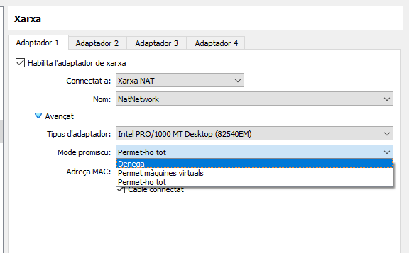

# PRÀCTICA: Analitzador de protocols Wireshark

ATENCIÓ: Els noms dels equips hosts al VirtualBox, el nom del sistema quan instal·leu, els noms de l'usuari, equip, etc. han de ser el vostre perquè a les captures es pugui veure.

Teniu l'exercici a fer al final d'aquest enunciat. Llegiu primer tot el document abans de començar la pràctica. sds

En general, heu de comprovar SEMPRE que els canvis de configuració que feu produeixen l'efecte desitjat amb el conjunt de proves necessari.

## Referències i ajuda

Wireshark és una eina molt potent i amb moltes opcions, aquí teniu un recopilatori de recursos.

Configurar Wireshark: <https://www.wireshark.org/docs/wsug_html/>

Manuals de Wireshark:

- <https://www.wireshark.org/#learnWS>
- <https://www.wireshark.org/docs/wsug_html/>
- <https://wiki.wireshark.org/FrontPage>

Exportar fitxers d'un PCAP amb Wireshark - <https://unit42.paloaltonetworks.com/using-wireshark-exporting-objects-from-a-pcap/>

Display filters - <https://unit42.paloaltonetworks.com/using-wireshark-display-filter-expressions/>

Identificar hosts i usuaris - <https://unit42.paloaltonetworks.com/using-wireshark-identifying-hosts-and-users/>

PCAP per analisi de tràfic i malware - <https://www.malware-traffic-analysis.net/index.html>

Anàlisi de tràfic amb Wireshark (INCIBE=Institut de Ciberseguretat d’Espanya):
<https://www.incibe.es/extfrontinteco/img/File/intecocert/EstudiosInformes/cert_inf_seguridad_analisis_trafico_wireshark.pdf>

Determinar el fabricant de la targeta a partir de l'identificador MAC - <https://maclookup.app/macaddress/8CBEBE>

## Objectius

L'objectiu d'aquesta activitat és treballar amb Wireshark, un sniffer o analitzador de protocols, per a resoldre alguns reptes d'obtenció d'informació.

## Introducció (teoria)

L'eina que farem servir és Wireshark, que ja tenim instal·lat al Kali Linux.
El protocol 'ICMP`(Internet Control Message Protocol) permet als dispositius de xarxa informar d'una errada. Per exemple, si un router no pot encaminar un paquet, el descarta i torna un error ICMP a l'emissor, o si un paquet acaba el seu TTL (Time To Live), el router el descarta i envia un missatge ICMP a l'emissor.

Ping és un dels serveis que ofereix ICMP. Serveix per comprovar si es pot accedir a un equip a la xarxa. També ens diu el temps que es triga en obtenir resposta.
Traceroute ens diu per quins routers passen els paquets fins arribar al host destí.

El protocol `ARP`(Address Resolution Protocol) permet, a partir d'una adreça IP, aconseguir l'adreça MAC corresponent. Això es fa preguntant en Broadcast a la xarxa qui té una determinada IP. En teoria, només contestarà un host.

El protocol `DNS`(Domain Name Service) permet traduir un nom de domini com ara `www.google.es` a una adreça IP. Podem veure aquesta traducció fent servir la comanda "nslookup `www.google.es`. També es pot obtenir a partir d'una adreça IP el nom de domini, tot i que no sempre funciona.

El protocol `FTP` (File Transfer Protocol) permet transferir o enviar fitxers entre hosts. Un servidor FTP obre el port 21 (port ftp) per a poder "conversar" amb ell (enviar ordres i rebre respostes).

Si es demanen dades, per exemple baixar un fitxer, s'obre una nova connexió entre servidor i client. En mode actiu, el client obre un port i indica al servidor que es connecti a aquest port. Però això implicaria al firewall obrir molts ports i no es permet normalment.

En mode passiu és el servidor qui obre un port per a les dades, indica al client quin és i llavors el client obre connexió nova per baixar-se les dades, que normalment és el contingut del directori o si s'ha fet un "get", és el fitxer demanat.

El protocol `HTTP/HTTPS`(Hypertext Transfer Protocol) és el protocol que permet visitar pàgines web.

## Filtres

El "display filter" de Wireshark usa expressions Booleanes. Això permet especificar valors i fer filtres complexos. Els operadors booleans són:

- Igual: "==" o "eq"
- No igual: "!="
- And (i lògic): "&&" o "and"
- Or (o lògic): "||" o "or"

Exemples:

Paquets que contenen les adreces 192.168.10.195 i 192.168.10.1 (una ha de ser origen i l'altra destí o al revés):

ip.addr eq 192.168.10.195 and ip.addr == 192.168.10.1

Petició http i a més conté l'adreça 192.168.10.195

http.request && ip.addr == 192.168.10.195

Petició http o bé resposta http (mostrarà les peticions i respostes)

http.request || http.response

Petició DNS de resolució de nom que contingui la cadena "microsoft" o bé petició DNS de resolució de nom que contingui la cadena "windows" (mostrarà les dues)

dns.qry.name contains microsoft or dns.qry.name contains windows

NOTA: Quan especifiquem un valor a excloure, no s'ha de fer servir "!=". En el seu lloc per exemple, si volem excloure el tràfic que no inclogui l'adreça IP 192.168.10.1, cal usar !(ip.addr eq 192.168.10.1) en lloc de ip.addr != 192.168.10.1 ja que aquest segon filtre no funciona bé.

## Exercicis

### Anàlisi en viu

#### ICMP

Kali ja té instal·lat Wireshark. Si esteu utilitzant un Ubuntu Desktop, instal·la i configura Wireshark.

Posa en marxa la captura de paquets de Wireshark sobre la targeta de xarxa del teu Kali amb adaptador pont:

    - Adreça IP: 192.168.c.x/24 on c és 2 per 2n A i 4 per 2n B i x el teu número de llista.
    - Porta d'enllaç: 192.168.c.254
    - DNS: 8.8.8.8

Obre una consola i executa un ping a algun servei o al router de l'escola. Deixa que faci quatre o cinc peticions i atura la comanda (el ping per defecte a Linux no para d'enviar paquets). NOTA: No facis un ping a la teva pròpia màquina perquè els paquets realment no surten de la teva màquina i el Wireshark no els pot capturar.

Atura la captura de paquets. Veuràs que s'ha capturat un munt de paquets, sense discriminar, però només volem veure els que fan referència al ping que hem fet.

Per fer-ho, apliquem un filtre de visualització, que permet triar el que volem veure de tot el que s'ha capturat.

Dintre aquest protocol trobem els tipus `echo request/reply`, que són els que fa servir la comanda ping. Escriurem la paraula `icmp` a "Filter:".

- Quin número de tipus de ICMP té la petició d'eco i quin la resposta d'eco? Com ho veus?.Incorpoar una captura de pantalla on es vegi el tipus de ICMP.

A les opcions avançades de la targeta activa el mode `promiscu` amb l'opció `Permetre-ho tot`.

- Fes una captura de trànsit, mentre navegues des de la màquina física. Quin trànsit pots veure relacionat amb el teu PC?

#### DNS

Centreu l'atenció en el protocol DNS posant un filtre de visualització (protocol DNS i adreça IP d'origen o destí la de la nostra màquina). Veieu la petició de resolució que fa el vostre client?

Comproveu que la resposta del servidor conté l'adreça IP de `www.xtec.cat` (comproveu amb la comanda nslookup quina és).

#### ARP

Ara mirarem el protocol ARP, que serveix als nostres equips per demanar per broadcast qui te una adreça IP determinada i obtenir la seva adreça MAC.

Quina adreça MAC té el gateway de la xarxa? Quin és el fabricant de la seva NIC?

### Anàlisi de captura. Arxius

Carrega la captura "captura1.pcapng" que teniu a la carpeta `files` d'aquest repositori.

Aconsegueix trobar la següent informació:

1.Al protocol ARP: Pots saber quina adreça MAC té l'equip amb adreça 192.168.1.1? Fes un filtre per a veure només els paquets d'aquesta adreça del protocol ARP.

2.A la sessió FTP:

- Quin és el password de l'usuari que inicia sessió? Quin nom té el fitxer que es descarrega del servidor?

3.A la sessió de Telnet:

- Pots veure el que veia l'usuari en connectar al telnet? Explica què és. Quins caràcters composen la nau espacial petita (posar com a resposta)?
- A quin domini pertany l'adreça on ens connectem?

4.A la sessió SSH:

- Pots saber a quin domini pertany l'adreça del servidor?
- Pots veure el contingut de les dades de la sessió? Enganxa les dades que conté el paquet ssh de longitud total 326 bytes.

5.Correu electrònic:

Ara carrega l'arxiu "captura2.pcapng" que també teniu al repositori, troba el missatge que s’ha enviat amb el protocol de correu sortint. Extreu el fitxer.

## Autoria i llicenciament

Autoria: Carlos Alonso Martínez

Aquesta pràctica ha estat realitzada a partir de material d'en Pau Tomé de l'IES Carles Vallbona (Granollers) que està llicenciat ambé sota una llicència Creative Commons Reconeixement-NoComercial-CompartirIgual 4.0 Internacional (CC BY-NC-SA 4.0).

Llicència: Creative Commons Reconeixement-NoComercial-CompartirIgual 4.0 Internacional (CC BY-NC-SA 4.0)
